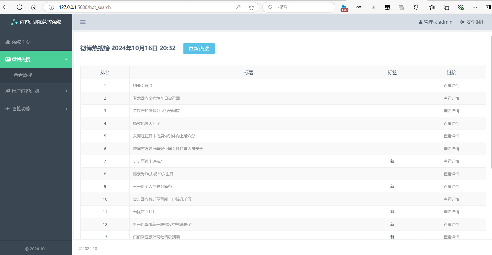
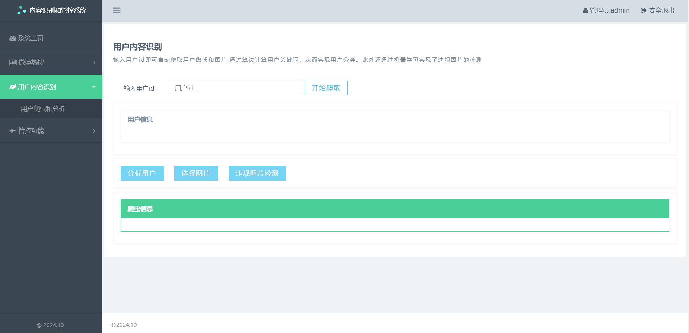
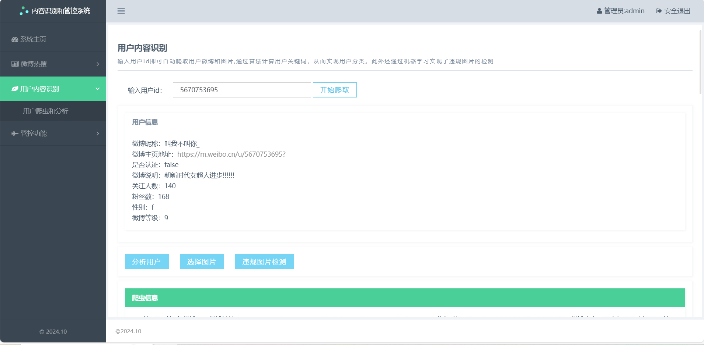
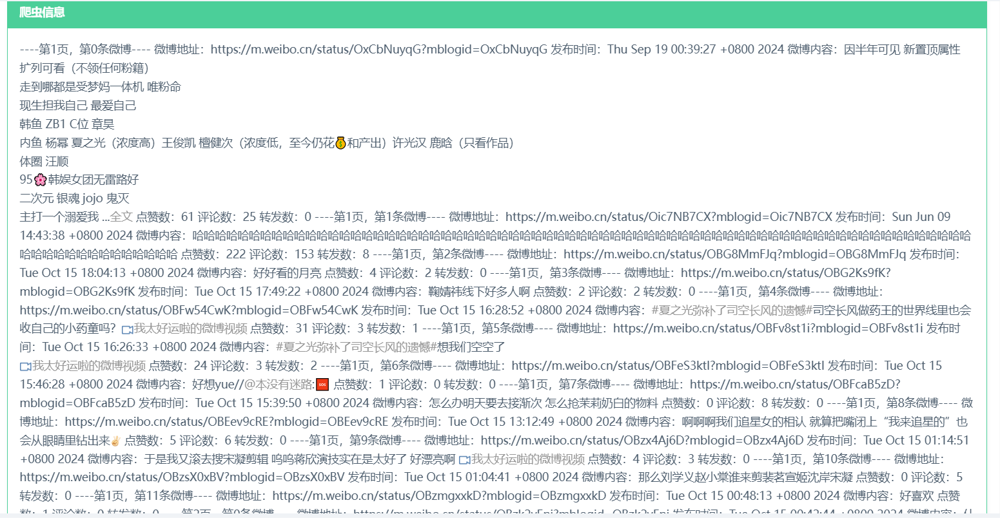
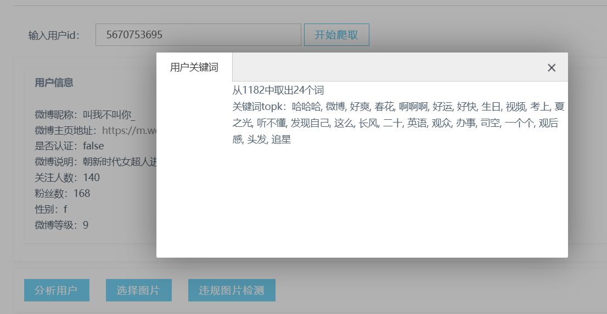
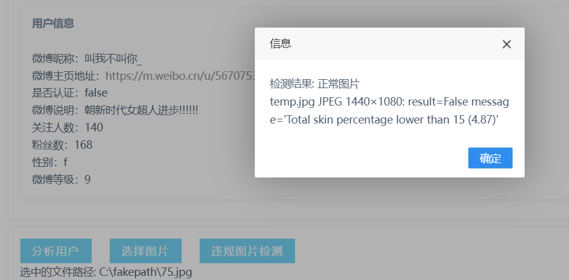
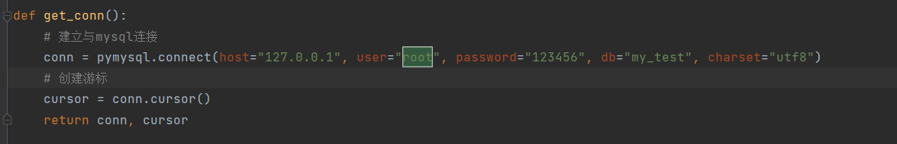
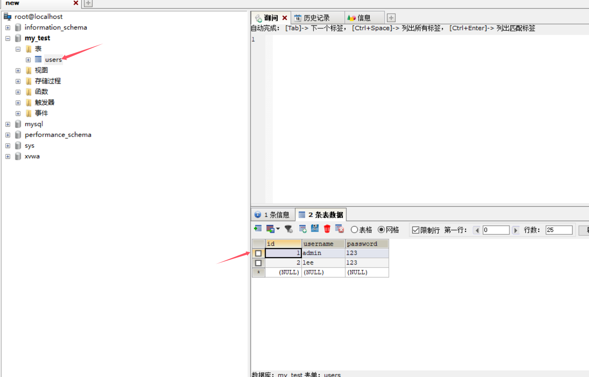
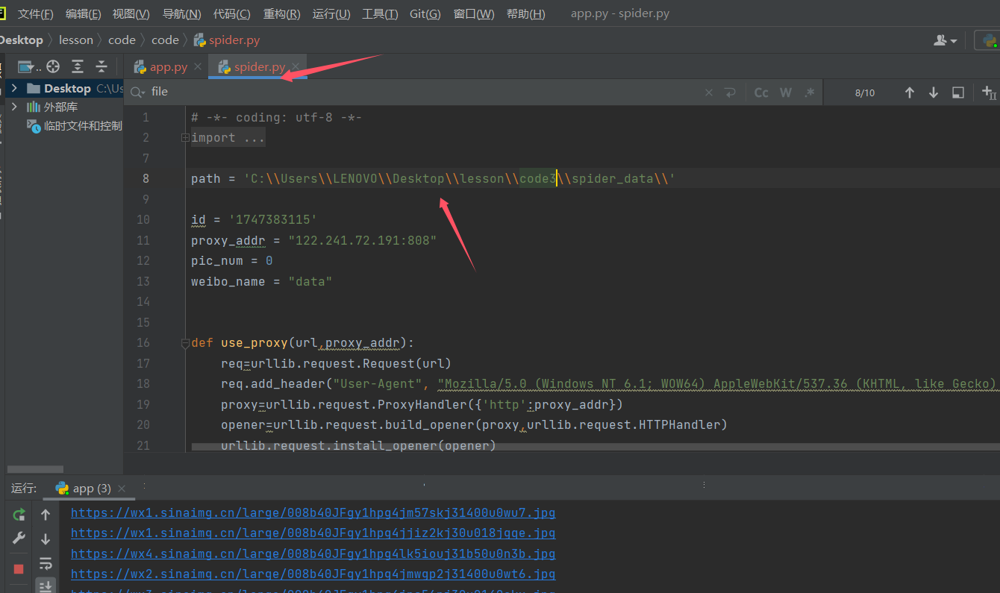
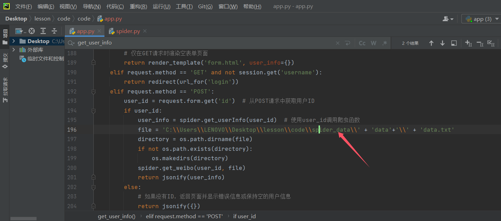

## 写在前面
&emsp;&emsp;此为HIT信安大四实践课程序，当初看要求的时候就感觉莫名其妙，最后看了一个学姐的帖子，就仿照着实现了。功能几乎相同，相对而言加了前端页面。在这里也开源给学弟学妹们，相当于给个参考思路。贴上原始的csdn帖子：https://blog.csdn.net/weixin_45937957/article/details/125189875?spm=1001.2014.3001.5506
&emsp;&emsp;此外，代码在第一次匆忙完工后就没有再改过了，大概率有很多屎山和莫名的bug，不过实现功能是没问题的(doge

## 展示
查看热搜：

爬取用户（爬取前）：

爬取用户（爬取后）：（默认爬取30条微博）

分析用户关键词：

选择图片后点击右侧违规图片检测：

管控功能中发送微博和评论都会在微博中真实生效，这里不演示了

## 配置
前端为HTML三件套，后端采用py3.10，后端框架Flask，没安包的直接安就行。
运行app.py即可
此外需要修改数据库和绝对路径：

## 说明
管控功能中的发微博和评论建议还是调用微博官方API实现,详见：
https://www.jianshu.com/p/4db0112744a0
https://www.jianshu.com/p/ee98f21b739b
微博官方API:
https://open.weibo.com/wiki/%E9%A6%96%E9%A1%B5
其中调用微博官方API需要完成身份认证，有时需要很长时间，所以本程序当时没有采用

除开调用官方API,还有两种方法自动发评论和微博：
1.利用Selenium：https://cloud.tencent.com/developer/article/1928716
2.利用requests库：https://www.bilibili.com/read/cv16370695/
&emsp;&emsp;本程序采取的第二种，更加简单和便捷。但有个致命的缺陷就是每次发送请求头中的Cookie和st都需要重新抓取替换。所以若要现场演示时记得按照上面👆帖子的办法提前替换weibo_api.py文件中的Cookie和st
&emsp;&emsp;此外，程序完成于2024年10月，因此上面的方法有可能失效。这里还是建议用微博官方API

### END